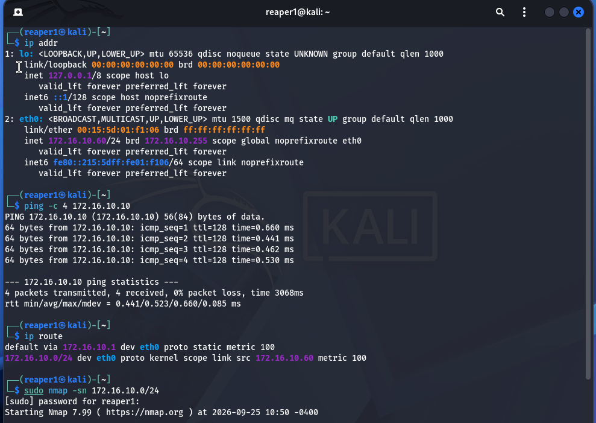
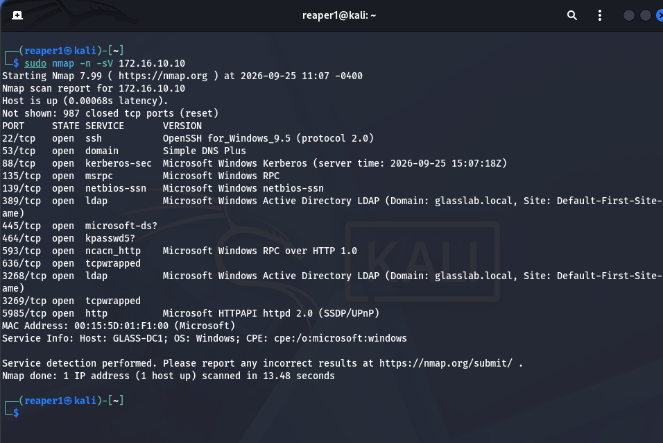
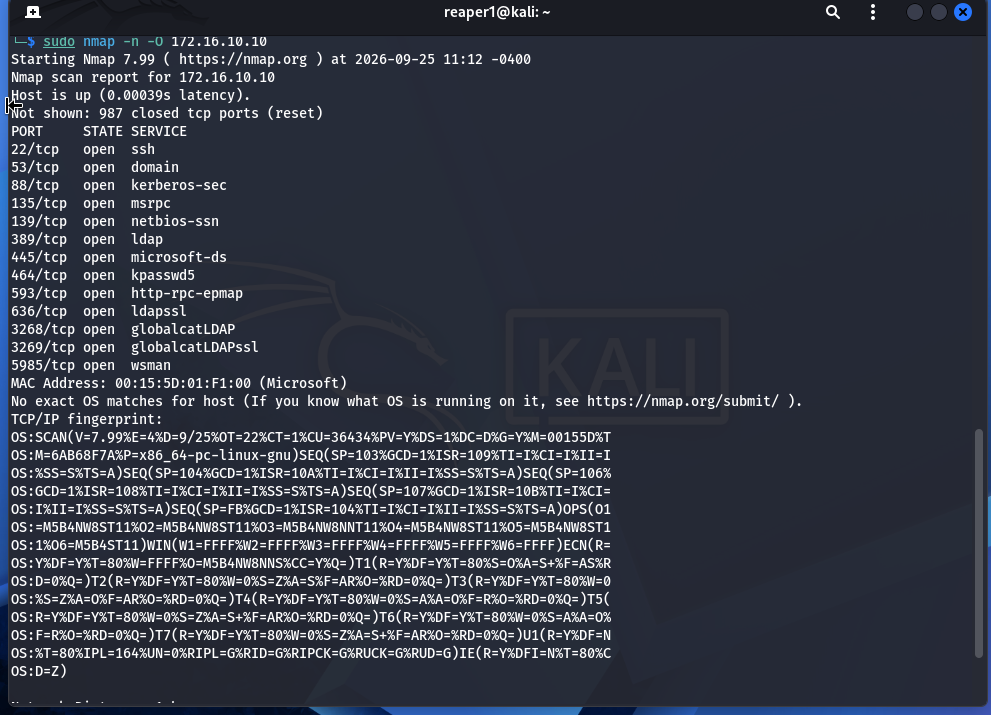
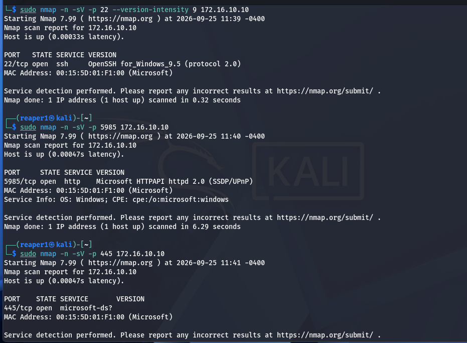
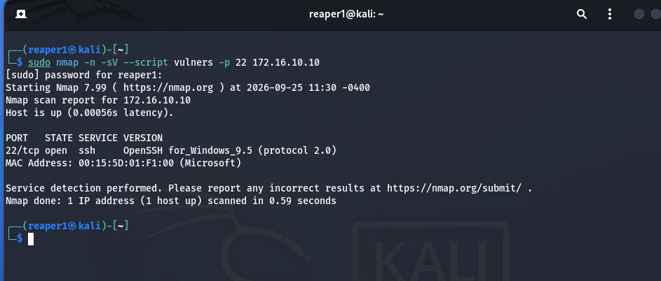
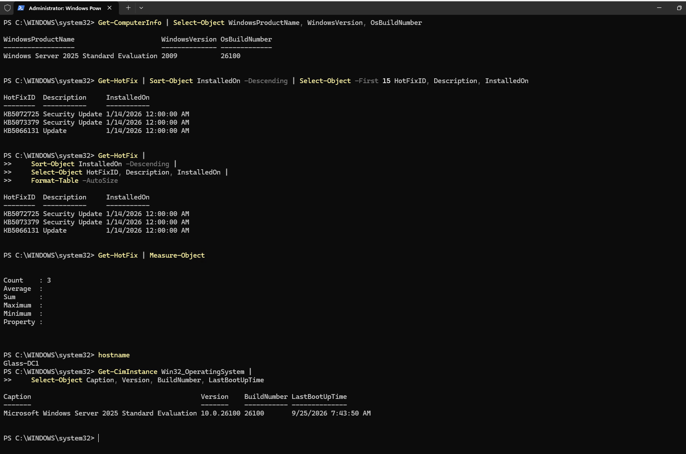
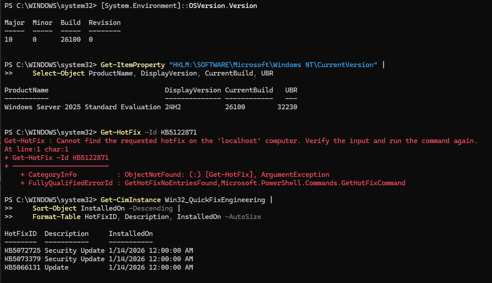
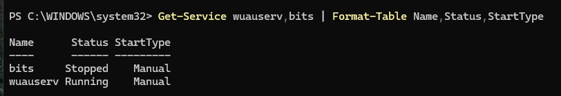
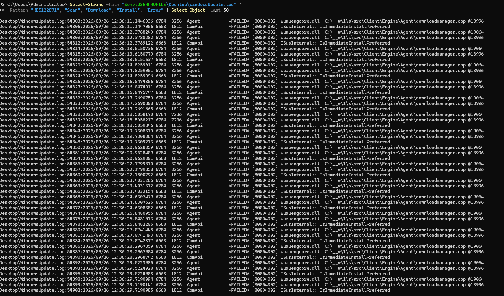

# DC1 Vulnerability Assessment

Scanning my own domain controller from an attacker's point of view, then checking from the inside whether it was patched. It wasn't, and Windows Update turned out to be failing.

| | |
| --- | --- |
| **Dates** | 2026-09-25 (external scan), 2026-09-26 (patch investigation) |
| **Scanner** | Kali Linux VM `reaper1`, `172.16.10.60` |
| **Target** | `Glass-DC1`, Windows Server 2025 Standard Evaluation, `172.16.10.10`, domain `glasslab.local` |
| **Network** | Isolated `mavlab` Hyper-V switch, `172.16.10.0/24`. Nothing here is reachable from the internet |
| **Status** | Exposure mapped. Patch failure still open |

Everything below was run against machines I own, on an isolated lab network.

## 1. Get on the network and find hosts

From Kali, I confirmed the address, the route out through the NAT gateway, and that DC1 answers, then swept the subnet for live hosts:

```bash
ip addr
ping -c 4 172.16.10.10
ip route
sudo nmap -sn 172.16.10.0/24
```



## 2. What DC1 exposes

```bash
sudo nmap -n -sV 172.16.10.10
```



13 open TCP ports. Most of them are what a domain controller is supposed to run:

| Port | Service | Expected on a DC? |
| --- | --- | --- |
| 53 | DNS | Yes |
| 88, 464 | Kerberos, Kerberos password change | Yes |
| 135, 593 | RPC, RPC over HTTP | Yes |
| 139, 445 | NetBIOS, SMB | Yes (Group Policy and SYSVOL need SMB) |
| 389, 636, 3268, 3269 | LDAP, LDAPS, Global Catalog | Yes |
| **22** | **OpenSSH for Windows 9.5** | **No.** I added it for the Rocky Linux SSH lab |
| **5985** | **WinRM over HTTP** | Management. Normal on Windows Server, but it should be restricted |

The scan banner also gave away the hostname (`GLASS-DC1`), the domain (`glasslab.local`), and the AD site name without any credentials. That's what an attacker on the same network learns in 13 seconds.

OS detection (`nmap -O`) found no exact match, so the fingerprint alone didn't identify the Windows version:



## 3. Look closer at the management ports

```bash
sudo nmap -n -sV -p 22 --version-intensity 9 172.16.10.10
sudo nmap -n -sV -p 5985 172.16.10.10
sudo nmap -n -sV -p 445 172.16.10.10
sudo nmap -n -sV --script vulners -p 22 172.16.10.10
```





The `vulners` script returned nothing for SSH. That doesn't mean the service is clean. `vulners` matches CVEs against the product and version nmap detected, and `OpenSSH for_Windows_9.5` isn't a standard OpenSSH version string, so there may have been nothing to match. Port 445 came back as `microsoft-ds?`, meaning nmap couldn't confirm the service version either.

## 4. Check patch level from the inside

On DC1:

```powershell
Get-ComputerInfo | Select-Object WindowsProductName, WindowsVersion, OsBuildNumber
Get-HotFix | Sort-Object InstalledOn -Descending | Select-Object HotFixID, Description, InstalledOn
Get-CimInstance Win32_OperatingSystem | Select-Object Caption, Version, BuildNumber, LastBootUpTime
```



`Get-HotFix` listed three updates, all installed on **2026-01-14**. The scan was on 2026-09-25, more than eight months later.

`Get-HotFix` doesn't list every kind of update, so I also read the exact build from the registry and checked for the specific update I was looking for:

```powershell
Get-ItemProperty "HKLM:\SOFTWARE\Microsoft\Windows NT\CurrentVersion" |
    Select-Object ProductName, DisplayVersion, CurrentBuild, UBR
Get-HotFix -Id KB5122871
```



The build is 24H2, `26100.32230`. `KB5122871` is not installed. The UBR (update build revision) is the number to compare against Microsoft's Windows Server 2025 release history to see which cumulative update the server is actually on.

## 5. Why updates weren't installing

```powershell
Get-Service wuauserv, bits | Format-Table Name, Status, StartType
```



Windows Update (`wuauserv`) was running. BITS was stopped, but both are Manual start, and BITS normally starts on demand, so a stopped BITS on its own isn't a fault.

Then I searched the update log on the Desktop (`Get-WindowsUpdateLog` writes it there by default):

```powershell
Select-String -Path "$env:USERPROFILE\Desktop\WindowsUpdate.log" `
    -Pattern "KB5122871", "Scan", "Download", "Install", "Error" | Select-Object -Last 50
```



The download manager was failing about once a second with `*FAILED* [80004002]` in `downloadmanager.cpp`, along with `ISusInternal:: IsImmediateInstallPreferred`. `0x80004002` is `E_NOINTERFACE`, a generic COM error. It says a component couldn't talk to another one, not which one or why.

## Findings

| # | Finding | Risk in this lab | Action |
| --- | --- | --- | --- |
| 1 | No updates installed since 2026-01-14 | High. A domain controller is the most valuable machine on the network | Fix Windows Update, install the latest cumulative update, confirm the UBR |
| 2 | Windows Update downloads failing with `0x80004002` | Root cause of finding 1 | Open. See next steps |
| 3 | SSH (22) on the domain controller | Medium. A second remote login path into the DC | Restrict to the admin workstation with Windows Firewall, or remove it when the SSH lab is done |
| 4 | WinRM over HTTP (5985) | Medium. Normal for remote PowerShell, but reachable from any host on the subnet | Restrict by source address; consider HTTPS (5986) |
| 5 | Hostname, domain, and site visible to an unauthenticated scan | Low. Expected behavior for a DC | None. Shows how much a DC reveals before an attacker has any credentials |

## Next steps

- Reset the Windows Update components (stop `wuauserv` and `bits`, rename `SoftwareDistribution` and `catroot2`, start the services) and scan again.
- If that fails, run `DISM /Online /Cleanup-Image /RestoreHealth` and `sfc /scannow`, since `E_NOINTERFACE` can come from damaged component registrations.
- Install the update manually from the Microsoft Update Catalog to separate "can't download" from "can't install".
- Rerun the nmap scan after adding firewall scopes to 22 and 5985, and record the before and after.

## What I took from this

- **Scan from outside first.** The service scan showed SSH still open on the domain controller, left over from a different lab.
- **An empty vulnerability result isn't a clean result.** `vulners` only knows what nmap identified. A nonstandard version string can mean no matches at all.
- **Check patch state from the inside.** Nothing in the external scan said "eight months unpatched". `Get-HotFix` and the registry did.
- **A running service doesn't mean a working one.** `wuauserv` was running the whole time. The log showed it failing every second.
